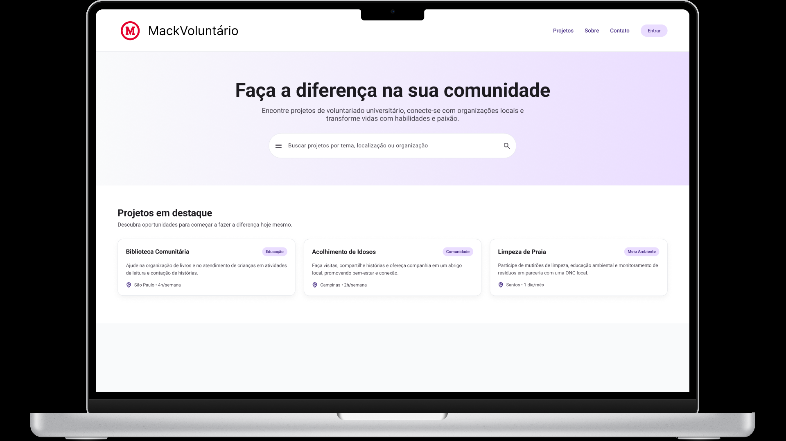
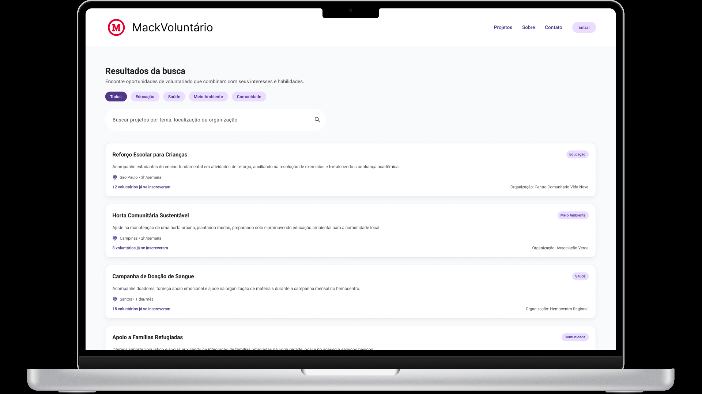
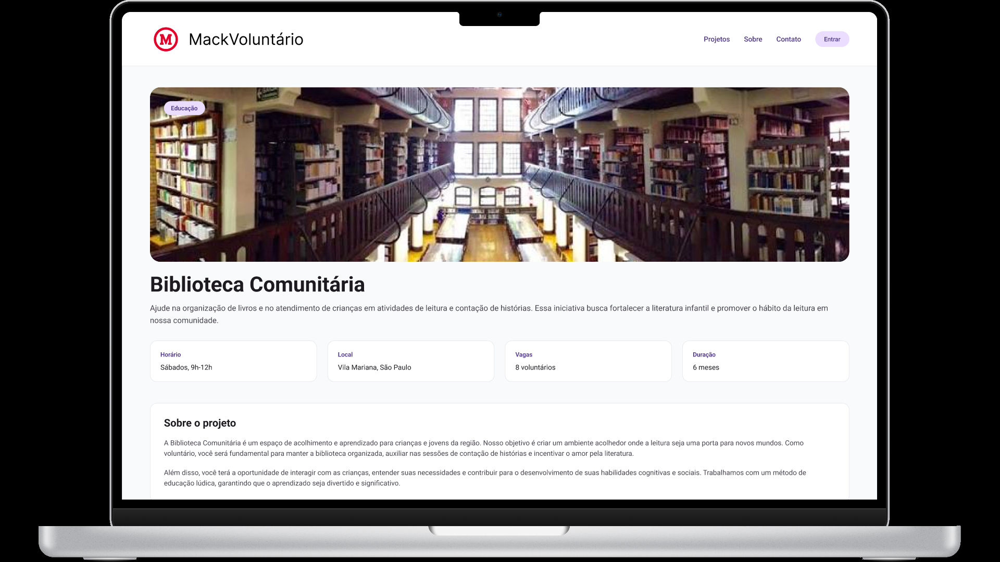

# MackVoluntario

## 1. Processo de Ideação

O projeto surgiu a partir da identificação da dificuldade que muitas pessoas encontram para descobrir oportunidades de voluntariado e, ao mesmo tempo, da dificuldade de projetos sociais em encontrar pessoas dispostas a colaborar.

A partir disso, foi definida a ideia de desenvolver uma plataforma que funcionasse como um ponto de conexão entre pessoas interessadas em realizar trabalho voluntário e projetos que precisam de voluntários.

Além disso alguns requisitos foram levantados:

* Facilitar a busca por oportunidades de voluntariado
* Permitir que o usuário encontre projetos de acordo com seus interesses
* Apresentar informações importantes sobre cada oportunidade
* Aproximar voluntários de organizações e projetos sociais

## 2. Protótipo Inicial

### Home

### Busca

### Informções sobre o projeto

## 3. Caráter Extensionista

O projeto possui caráter extensionista por buscar aplicar os conhecimentos adquiridos durante a formação acadêmica na resolução de uma necessidade presente na sociedade.

A proposta da plataforma está relacionada à promoção do voluntariado e ã aproximação entre a comunidade e iniciativas sociais.

Por meio da aplicaçào, buscamos contribuir para que mais pessoas tenham acesso a oportunidades de participação em projetos sociais, incentivando valores como:

* Cidadania
* Solidariedade
* Responsabilidade social
* Colaboração
* Participação comunitária

Dessa forma, o projeto busca utilizar a tecnologia como uma ferramenta para gerar impacto social.

## 4. Tutorial de Desenvolvimento

## 5. Conclusão

## Integrantes

Alex Kazuo Kodama - 10417942

Eduardo Oliveira Carvalho - 10417170

Hailo Rodrigues da Silva Neto - 10416839
